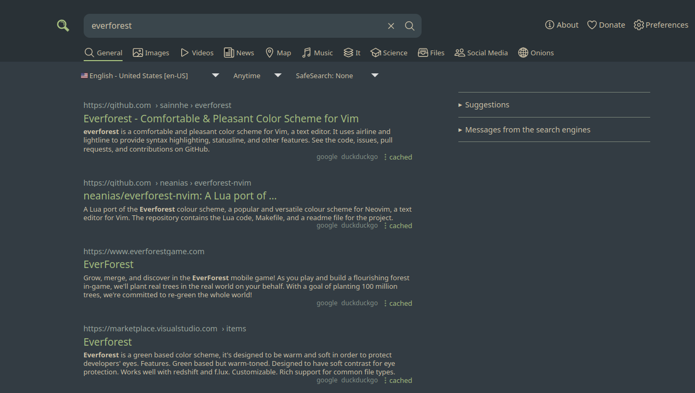

# Everforest for SearXNG

<p align="center">
  
</p>

## Usage
This userstyle is applied by default on a few commonly used SearXNG servers, listed at the top:
```css
@-moz-document url-prefix("https://searx.baczek.me/"), url-prefix("https://searx.be/") {
```
If the theme isn't being applied to your instance, go to the userstyle's **Settings > Custom included sites** and add your instance to the list, for instance, `*://searxng.example.com/*`.
